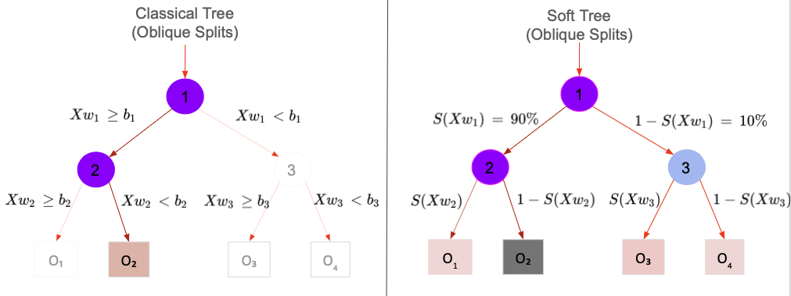
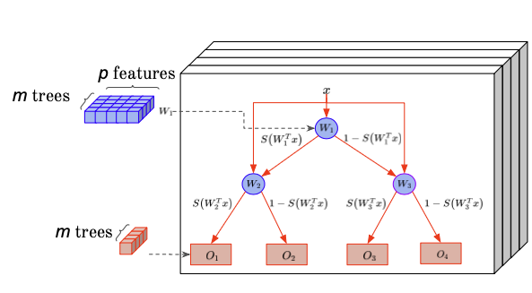
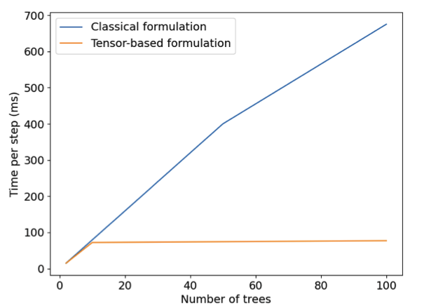
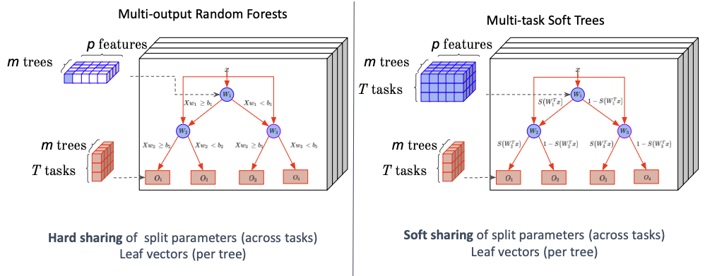

# Context and Background
On this page, we describe the main findings in [Ibrahim, Hazimeh and Mazumder, 2022](https://dl.acm.org/doi/pdf/10.1145/3534678.3539412).

Our contributions can be summarized as follows:

   - Proposition of a flexible framework for training differentiable tree ensembles with seamless support for new loss functions.
   - Introduction of a novel, tensor-based formulation for differentiable tree ensembles that allows for efficient training on GPUs.
   - Extension of differentiable tree ensembles to multi-task learning settings by introducing a new regularizer that allows for soft parameter sharing across tasks.
   - Introduction of FASTEL — a new toolkit (based on Tensorflow 2.0) for learning differentiable tree ensembles

The code for FASTEL is available [here](https://github.com/ShibalIbrahim/FASTEL). 
The paper is available [here](https://dl.acm.org/doi/pdf/10.1145/3534678.3539412).

## Background on differentiable tree ensembles

### Differentiable decision trees

Classical decision trees perform hard sample routing, i.e., a sample is routed to exactly one child at every splitting node. Hard sample routing introduces discontinuities in the loss function, making trees unamenable to continuous optimization. Therefore, trees are usually built in a greedy fashion. 
To tackle that problem, we introduce the concept of soft tree, which can be extended to soft tree ensembles. 
A soft tree is a variant of a decision tree that performs soft routing, where every internal node can route the sample to the left and right simultaneously, with different proportions. This routing mechanism makes soft trees differentiable, so learning can be done using gradient-based methods.

<figure align="middle">
  
  <figcaption> 
  Comparison of soft tree vs. classic tree routing methods. On the classic tree a sample is routed to exactly one child at every splitting node, on the other side, a sample is routed to the left and right simultaneously, with different proportions, given a logistic function S 
    
  
  </figcaption>
</figure>

Internal (split) nodes in a differentiable tree perform soft routing, where a sample is routed left and right with different proportions. Although the sample routing is formulated with a probabilistic model, the final prediction of the tree $f$ is a deterministic function as it assumes an expectation over the leaf predictions. Classical decision trees are modeled with either axis-aligned splits or hyperplane (a.k.a. oblique) splits. Soft trees are based on hyperplane splits, where the routing decisions rely on a linear combination of the features. 

### Differentiable tree ensembles

We learn an ensemble of m differentiable trees. Let  $f^j$ be the $j$ th tree in the ensemble. For easier exposition, we consider a single-task regression.
For an input feature-vector $x \in \mathbb{R}^p$ , we learn an additive model with the output being sum over outputs of all the trees:

\begin{equation}
f(x) = \sum_{j=1}^m f^j(x)
\end{equation}

The output, $f(x)$, is a vector in $\mathbb{R}^k$ containing raw predictions. For multiclass classification, mapping from raw predictions to $Y$ is done by applying a softmax function on the vector $f (x )$ and returning the class with the highest probability.

### Predictions
As with classical decision trees, we can assume that each leaf stores a weight vector $o_l^j \in \mathbb{R}^k$ (learned during training). Therefore, for a sample $x \in \mathbb{R}^p$ , the prediction of the tree can be defined as the expected value of the leaf outputs, i.e.,

\begin{equation}
f^j(x) = \sum_{l \in L} P^j(\{x → l\}) o_l^j
\end{equation}

where $L$ is the set of leaves in the tree

<figure align="middle">
  
  <figcaption>  
    
  
  </figcaption>
</figure>

## Description of FASTEL

### Efficient tensor formulation

Current differentiable tree ensemble proposals and toolkits model trees individually. This leads to slow CPU-training times and makes these implementations hard to vectorize for fast GPU training.

<figure align="middle">
  
  <figcaption> Classical formulations for Soft Tree ensembles model trees individually  </figcaption>
</figure>

In that context, we model the internal nodes in the trees across the ensemble jointly as a “supernodes”. More details on the tensor formulation can be found in the [paper](https://dl.acm.org/doi/pdf/10.1145/3534678.3539412), section 3.2.

<figure align="middle">
  
  <figcaption> Timing comparison of classical formulation against our tensor-based formulation of a tree ensemble. Tensor-based formulation with CPU training is up to 10× faster than classical formulation. Tensor-based formulation with GPU training leads to an additional 40% improvement, leading to an effective 20× gain over classical formulation.  </figcaption>
</figure>

### Flexible loss functions

Our framework can handle **any differentiable loss function**. Such flexibility is important as various applications require flexibility in loss functions beyond what is provided by current tree ensemble learning toolkits. Our framework is built on Tensorflow, which allows for scalable gradient-based optimization. This coupled with our efficient differentiable tree ensemble formulation gives a powerful toolkit to seamlessly experiment with different loss functions and select what is suitable for the intended application. A few examples of flexible distributions that our toolkit supports — due to compatibility with Tensorflow-Probability — are normal, Poisson, gamma, exponential, mixture distributions e.g., zero-inflation models, and compound distributions e.g., negative binomial. Other loss functions such as those robust to outliers can also be handled.

More details on the flexible loss functions can be found in the [paper](https://dl.acm.org/doi/pdf/10.1145/3534678.3539412), section 4.

#### Zero-inflated Poisson Regression

As described above, our model can be usef with any differentiable loss function. In this example, we show how to use our framework to learn a zero-inflated Poisson regression model. 
Zero-inflation occurs in many applications, e.g., understanding alcohol and drug abuse in young adults, characterizing undercoverage and overcoverage to gauge the on-going quality of the census frames, studying popularity of news items on different social media platforms, financial services applications etc. Despite the prevalence of these applications, there has been limited work on building decision tree-based approaches for zero-inflated data perhaps due to a lack of support public toolkits. Therefore, practitioners either resort to Poisson regression with trees or simpler linear models to handle zero-inflated responses. A Poisson model can lead to sub-optimal performance due to the limiting equidispersion constraint (mean equals the variance). Others take a two-stage approach, where a classification model distinguishes the zero and non-zero and a second model is used to model the non-zero responses. This can be sup-optimal as errors in the first model can deteriorate the performance of the second model. We employ a more well-grounded approach by formulating the joint mixture model, where one part of the model tries to learn the mixture proportions (zero vs non-zero) and the other part models the actual non-zero responses. Such a mixture model permits a differentiable loss function when both components of the model are parameterized with differentiable tree ensembles and can be optimized with gradient descent method in an end-to-end fashion without the need for a custom solver. We provide an extensive study with our framework on small to large-scale real world zero-inflated datasets and demonstrate that such flexibility in distribution modeling can lead to significantly more compact and expressive tree ensembles. This has large implications for faster inference, storage requirements and interpretability.

### Multi-task learning with tree ensembles

Multi-task Learning (MTL) aims to learn multiple tasks simultaneously by using a shared model. Unlike single task learning, MTL can achieve better generalization performance through exploiting task relationships.
One key problem in MTL is how to share model parameters between tasks.
For instance, sharing parameters between unrelated tasks can potentially degrade performance. MTL approaches for classical decision trees approaches e.g., RF, GRF have shared weights at the splitting nodes across the tasks.
Only the leaf weights are task specific. 
However this can be limiting in terms of performance, despite easier interpretability associated with the same split nodes across tasks.

To perform flexible multi-task learning, we extend our [efficient tensor formulation](#efficient-tensor-formulation) by using task-specific nodes in the tree ensemble. This is intensively studied in the [paper](https://dl.acm.org/doi/pdf/10.1145/3534678.3539412), section 5.

<figure align="middle">
  
  <figcaption> Classical approach to multitasking vs proposed approach.  </figcaption>
</figure>

### Results

Experiments performed on a collection of 28 open-source and real-world datasets, demonstrated that our new FASTEL toolkit can lead to 100x more compact ensembles and up to 23% improvement in out-of-sample performance, compared to tree ensembles learnt by popular toolkits such as XGBoost, as described in the [here, section 6](https://dl.acm.org/doi/pdf/10.1145/3534678.3539412)

