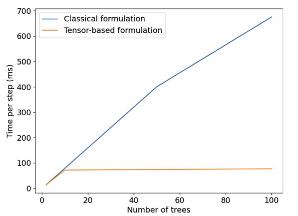

# FASTEL 

On this page, we describe the main findings in Ibrahim, Hazimeh and Mazumder, 2022.

Our contributions can be summarized as follows:

   - Proposition of a flexible framework for training differentiable tree ensembles with seamless support for new loss functions.
   - Introduction of a novel, tensor-based formulation for differentiable tree ensembles that allows for efficient training on GPUs.
   - Extension of differentiable tree ensembles to multi-task learning settings by introducing a new regularizer that allows for soft parameter sharing across tasks.
   - Introduction of FASTEL — a new toolkit (based on Tensorflow 2.0) for learning differentiable tree ensembles

The code for FASTEL is available [here](https://github.com/ShibalIbrahim/FASTEL). 

### Efficient tensor formulation

Current differentiable tree ensemble proposals and toolkits, model trees individually. This leads to slow CPU-training times and makes these implementations hard to vectorize for fast GPU training.

In that context, we propose to model the internal nodes in the trees across the ensemble jointly as a “supernodes”. In particular, an internal node $i \in \mathcal{I}^j$ at depth $d$ in all trees can be condensed together into a supernode $i\in \mathcal{I}. We define a learnable weight matrix $W_i \in \mathbb{R}^{p,m}$, where each $j$-th column of the weight matrix contains the learnable weight vector $w_i^j$ of the original $j$-th tree in the ensemble. Similarly, the leaf nodes are defined to store a learnable weight matrix $O_l \in \mathbb{R}^{m,k}$ , where each $j$-th row contains the learnable weight vector $o_l^j$ in the original $j$-th tree in the ensemble. The prediction of the tree with supernodes can be written as

\begin{equation}
f(x) = (\sum_{l \in \mathcal{L}}O_l \bigodot \prod_{i \in A(l)}R_{i,l}) · 1_m
\end{equation}

where $\bigdot$ denotes the element-wise product, $R_{i,l}= S(W_i ·x)1[l \swarrow i]\bigodot(1 − S(W_i ·x))1[i \searrow l] \in \mathbb{R}^{m,l}$ and the activation function $S$ is applied element-wise. This formulation of tree ensembles via supernodes allows for sharing of information across tasks via tensor formulation in multi-task learning.

<figure align="middle">
  
  <figcaption> Timing comparison of classical formulation against our tensor-based formulation of a tree ensemble. Tensor-based formulation with CPU training is up to 10× faster than classical formulation. Tensor-based formulation with GPU training leads to an additional 40% improvement, leading to an effec- tive 20× gain over classical formulation.  </figcaption>
</figure>

### Flexible loss functions

Our framework can handle any differentiable loss function. Such flexibility is important as various applications require flexibility in loss functions beyond what is provided by current tree ensemble learning toolkits. Our framework is built on Tensorflow, which allows for scalable gradient-based optimization. This coupled with our efficient differentiable tree ensemble formulation gives a powerful toolkit to seamlessly experiment with different loss functions and select what is suitable for the intended application. A few examples of flexible distributions that our toolkit supports — due to compatibility with Tensorflow-Probability — are normal, Poisson, gamma, exponential, mixture distributions e.g., zero-inflation models, and compound distributions e.g., negative binomial. Other loss functions such as those robust to outliers can also be handled.

### Multi-task learning with tree ensembles

Multi-task Learning (MTL) aims to learn multiple tasks simultaneously by using a shared model. Unlike single task learning, MTL can achieve better generalization performance through exploiting task relationships. One key problem in MTL is how to share model parameters between tasks. For instance, sharing parameters between unrelated tasks can potentially degrade performance. MTL approaches for classical decision trees approaches e.g., RF, GRF have shared weights at the splitting nodes across the tasks. Only the leaf weights are task specific. However this can be limiting in terms of performance, despite easier interpretability associated with the same split nodes across tasks.

To perform flexible multi-task learning, we extend our formulation from [here](#efficient-tensor-formulation) by using task-specific nodes in the tree ensemble. We consider $T$ tasks. For easier exposition, we consider tasks of the same kind: multilabel classification or multi-task regression. For multilabel classification, each task is assumed to have same number of classes (with $k = C$) for easier exposition — our framework can handle multilabel settings with different number of classes per task. Similarly, for regression settings, $k = 1$. For multi-task zero-inflated Poisson or negative binomial regression, when two model components need to be estimated, we set $k = 2$ to predict log-mean and logit components for zero-inflated Poisson and log-mean and log-dispersion components for negative binomial.

We define a trainable weight tensor $\mathcal{W}_i \in \mathbb{R}^{T,p,m}$ for supernode $i \in \mathcal{I}$, where each $t$-th slice of the tensor $\mathcal{W}_i[t, :, :]$ denotes the trainable weight matrix associated with task $t$. The prediction in this case is given by

\begin{equation}
\begin{equation}
f(x) = (\sum_{l \in L}\mathcal{O}_l \bigodot \prod_{i \in A(l)}\mathcal{R}_{i,l}) · 1_m
\end{equation}

where $\mathcal{O} \in \mathbb{R}^{T,m,k}$ denotes the trainable leaf tensor in leaf l, $R_{i,l}= S(\mathcal{W}_i ·x)1[l \swarrow i]\bigodot(1 − S(\mathcal{W}_i ·x))1[i \searrow l] \in \mathbb{R}^{m,l,1}$, and the activation function $S$ is applied element-wise. This formulation of tree ensembles via supernodes allows for sharing of information across tasks via tensor formulation in multi-task learning.

In order to share information across the tasks, our framework imposes a closeness penalty on the hyperplanes $\mathcal{W}_i$ in the supernodes across the tasks. This results in the optimization formulation:

TO BE ADDED WITH RAW LATEX

where $W \in RI,T,m,p$ denotes all the weights in all the supernodes, $O ∈ RL,m,k$ denotes all the weights in the leaves, and $λ ∈ [0, ∞)$ is a non-negative regularization penalty that controls how close the weights across the tasks are. For $λ = 0$, the model behaves similar to a single-task learning setting. When $λ → ∞$, the model shares complete information in the splitting nodes and the weights across the tasks in each of the internal supernodes become the same — this is similar to hard parameter sharing. The latter case can be separately handled more efficiently by using the function definition for $f (x )$ without any closeness regularization. Our model can control the level of sharing across the tasks by controlling $λ$. In practice, we tune over $λ ∈ [1e − 5, 10]$ and select the optimal value based on a validation set. This penalty assumes that the hyperplanes across the tasks should be equally close as we go down the depth of the trees. However this assumption maybe less accurate as we go down the tree. Empirically, we found that decaying $λ$ exponentially as $λ/2d$ with depth $d$ of the supernodes in the ensemble can achieve better test performance.

### Results
TO BE COMPLETED WITH raw latex tables 