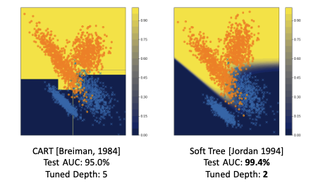

# Flexible Modeling and Multitask Learning using Differentiable Tree Ensembles
** Authors: Shibal Ibrahim, Hussein Hazimeh, Rahul Mazumder **

This site provides an introduction to FASTEL, a new toolkit for learning differentiable tree ensembles [(2022, Ibrahim, Hazimeh and Mazumder)](https://dl.acm.org/doi/pdf/10.1145/3534678.3539412). An introduction to differentiable tree ensembles can be found below. To dive in, a code tutorial can be found in the [Tutorial Section](tutorial.md). 

Our contributions, which can be summarized as follows, are:

   - Proposition of a flexible framework for training differentiable tree ensembles with seamless support for new loss functions.
   - Introduction of a novel, tensor-based formulation for differentiable tree ensembles that allows for efficient training on GPUs.
   - Extension of differentiable tree ensembles to multi-task learning settings by introducing a new regularizer that allows for soft parameter sharing across tasks.
   - Introduction of FASTEL — a new toolkit (based on Tensorflow 2.0) for learning differentiable tree ensembles

To have more details about our countributions, please visit [Fastel](fastel.md). 

## Introduction to differentiable tree ensembles

### Differentiable decision trees

Classical decision trees perform hard sample routing, i.e., a sample is routed to exactly one child at every splitting node. Hard sample routing introduces discontinuities in the loss function, making trees unamenable to continuous optimization. Therefore, trees are usually built in a greedy fashion. 
To tackle that problem, we introduce the concept of soft tree, which can be extended to soft tree ensembles. 
A soft tree is a variant of a decision tree that performs soft routing, where every internal node can route the sample to the left and right simultaneously, with different proportions. This routing mechanism makes soft trees differentiable, so learning can be done using gradient-based methods.

<figure align="middle">
  
  <figcaption> 
  Comparison of soft tree vs. classic tree routing methods. On the classic tree a sample is routed to exactly one child at every splitting node, on the other side, a sample is routed to the left and right simultaneously, with different proportions, given a logistic function S 
    
  
  </figcaption>
</figure>

Internal (split) nodes in a differentiable tree perform soft routing, where a sample is routed left and right with different proportions. Although the sample routing is formulated with a probabilistic model, the final prediction of the tree $f$ is a deterministic function as it assumes an expectation over the leaf predictions. Classical decision trees are modeled with either axis-aligned splits or hyperplane (a.k.a. oblique) splits. Soft trees are based on hyperplane splits, where the routing decisions rely on a linear combination of the features. Particularly, each internal node $i \in \mathcal{I}^j$ is associated with a trainable weight vector $w_i^j \in \mathbb{R}^p$ that defines the node’s hyperplane split. Given a sample $x \in \mathbb{R}^p$ , the probability that internal node i routes $x$ to the left is defined by $S(w_i^j ·x)$,where $S : \mathbb{R} → [0, 1]$ is an activation function. Popular choices for $S$ include logistic function and smooth-step function (for conditional computation as in classical trees with oblique splits). 

### Differentiable tree ensembles

We learn an ensemble of m differentiable trees. Let  $f^j$ be the $j$ th tree in the ensemble. For easier exposition, we consider a single-task regression.
For an input feature-vector $x \in \mathbb{R}^p$ , we learn an additive model with the output being sum over outputs of all the trees:

\begin{equation}
f(x) = \sum_{j=1}^m f^j(x)
\end{equation}

The output, $f(x)$, is a vector in $\mathbb{R}^k$ containing raw predictions. For multiclass classification, mapping from raw predictions to $Y$ is done by applying a softmax function on the vector $f (x )$ and returning the class with the highest probability.

### Predictions
As with classical decision trees, we can assume that each leaf stores a weight vector $o_l^j \in \mathbb{R}^k$ (learned during training). Therefore, for a sample $x \in \mathbb{R}^p$ , the prediction of the tree can be defined as the expected value of the leaf outputs, i.e.,

\begin{equation}
f^j(x) = \sum_{l \in L} P^j(\{x → l\}) o_l^j
\end{equation}

where $L$ is the set of leaves in the tree

<figure align="middle">
  
  <figcaption>  
    
  
  </figcaption>
</figure>

### Conclusion
End-to-end learning with differentiable tree ensembles appears to have several advantages. 

 1. Training is easy to set up in public deep learning frameworks. Differentiable tree ensembles allow for flexibility in loss functions without the need for specialized algorithms. For example, mixture likelihoods can be easily implemented in Tensorflow Probability, which allows for handling zero-inflated data. Similarly, multi-task loss objectives can also be handled. 
 2. With a careful implementation, the tree ensemble can be trained efficiently on GPUs — this is not possible with earlier toolkits such as TEL.
 3. Differentiable trees can lead to more expressive and compact ensembles. This can have important implications for interpretability, latency and storage requirements during inference.

This is the framework implemented in the FASTEL package. To see it in action, the tutorial can be found [here](tutorial.md). 